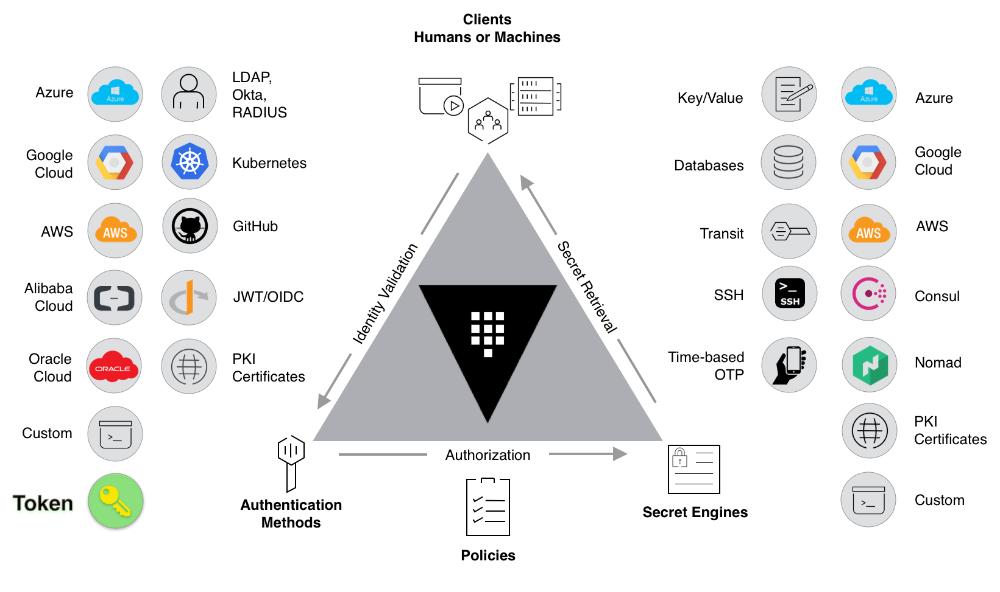

# PRESENTATION

## How it works ?

source : https://learn.hashicorp.com/tutorials/vault/getting-started-secrets-engines

## Video (admin part)

https://www.youtube.com/watch?v=jlQ1yvMET0o&t=779s

## Authentication

- Tokens
- AppRole
- AWS
- Azure
- Github
- JWT/OIDC
- Kubernetes
- LDAP
- ...

## Policies

    path "secret/foo" {
        capabilities = ["read"]
    }

    path "secret/*" {
        capabilities = ["create", "read", "update", "delete", "list"]
    }

Ex :

    /secret/machine/dev/db/db1
    /secret/machine/dev/db/db2
    /secret/machine/dev/apps/app1
    /secret/machine/dev/apps/app2

    /secret/machine/prod/...

    /secret/users/accounts/user1
    /secret/users/accounts/admin1

    /secrets/database/production/myservice1

## Spring Cloud Vault 

    /secret/{application}/{profile}
    /secret/{application}
    /secret/{defaultContext}/{profile}
    /secret/{defaultContext}

NB: The "application" is injected as the spring.application.name in the SpringApplication (i.e. what is normally "application" in a regular Spring Boot app)

Ex Config:

    spring.cloud.vault:
        generic:
            enabled: true
            backend: secret
            profile-separator: '/'
            default-context: prod
            application-name: my-app

Result of search :

    secret/my-app
    secret/prod/<activeProfile>